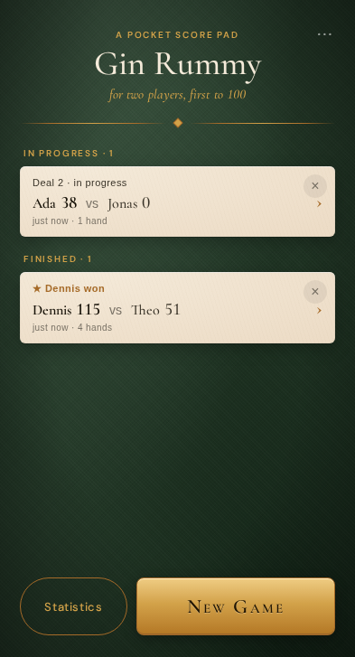
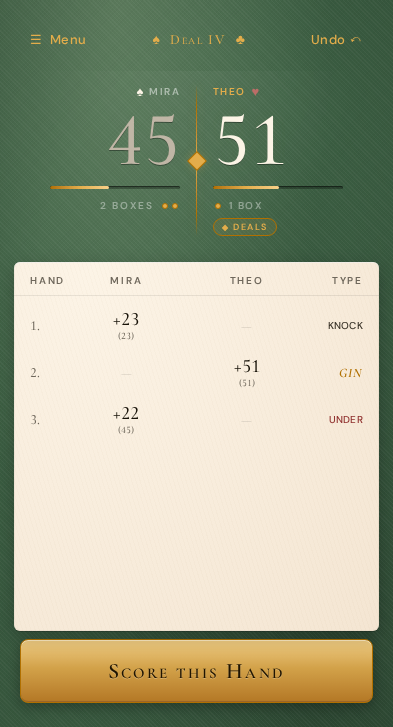
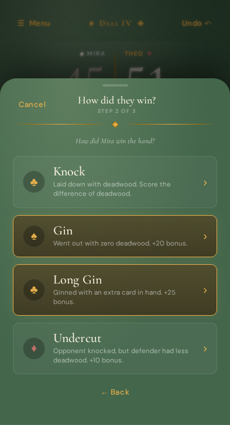
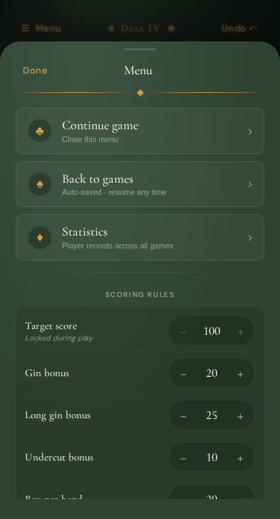
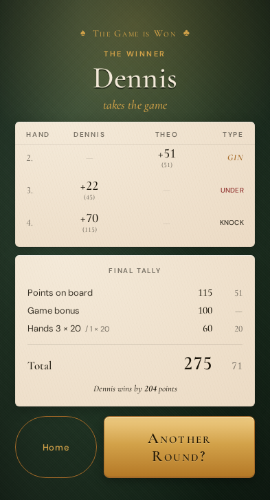
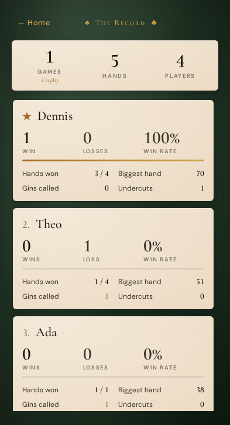

# Gin Rummy Score Pad

A score pad for two-player gin rummy, built as an offline-capable PWA. Record each hand in three taps, fix mistakes with undo or edit, and let the app handle boxes, game and shutout bonuses at the end.

**Live:** https://dennis-brutski.github.io/gin-rummy-score-pad/

<p>
  
  
  
</p>
<p>
  
  
  
</p>

## Features

- **Fast hand entry:** pick the winner, how they won (knock, gin, long gin, undercut), then type the deadwood.
- **Undo and edit:** undo the last hand, or tap any row in the ledger to change or delete it. Scores are recalculated.
- **Many games at once:** games save automatically and can be resumed from the home screen.
- **Custom scoring rules:** change the target and every bonus. Changing them mid-game rescores the hands already played.
- **Statistics:** wins, win rate, hands won, gins, undercuts and biggest hand per player.
- **Works offline and installs on your phone.** Your data stays on the device; export and import a backup from settings.
- **9 languages:** English, German, Russian, Spanish, French, Portuguese, Italian, Chinese, Japanese.

## Scoring

The defaults follow the classic rules from [Hoyle / pagat.com](https://www.pagat.com/rummy/ginrummy.html) and [Bicycle](https://bicyclecards.com/how-to-play/gin-rummy):

| Rule | Default |
| --- | --- |
| Target score | 100 |
| Knock | difference in deadwood |
| Gin bonus | +20 plus opponent's deadwood |
| Long (big) gin bonus | +25 plus opponent's deadwood |
| Undercut bonus | +10 plus difference in deadwood |
| Box (line) bonus | +20 per hand won, added at game end |
| Game bonus | +100 for the winner |
| Shutout bonus | +100 extra if the loser won no hands |

House rules vary. A common variant is 25 for gin, undercut and box. Change any value under **Menu → Scoring rules**. Every game keeps its own copy of the rules, so changing them never alters games that are already finished.

## Install on your phone

Open the live link, then:

- **iPhone (Safari):** Share → *Add to Home Screen*
- **Android (Chrome):** menu → *Install app*

After the first visit it works without a connection.

## Updates

The app updates itself; there's nothing to reinstall. When a new version has been deployed, the app downloads it in the background and shows **New version available · Reload**. Tap *Reload* to switch right away — a game in progress is kept, since everything is saved as you play — or dismiss it with ✕ and the update applies the next time the app is fully closed. An installed app also checks for updates each time you bring it back to the foreground.

For developers: `npm run build` stamps `dist/sw.js` with a hash of the app files (`app.js`, `styles.css`, `index.html`, `manifest.json`, `sw.js`). Only a change to those files counts as a new version, so a README-only push doesn't prompt anyone. Fonts and icons aren't part of the hash — give a replacement a new file name.

## Development

```sh
npm ci
npm run build        # bundles src/ + public/ into dist/ via esbuild
npm test             # unit tests (node --test)
npm run e2e          # Playwright end-to-end tests
npm run screenshots  # regenerates docs/screenshots/ from a scripted demo game
```

Built with React 19 and esbuild, and no other framework. Pushing to `master` deploys to GitHub Pages via `.github/workflows/pages.yml`.
